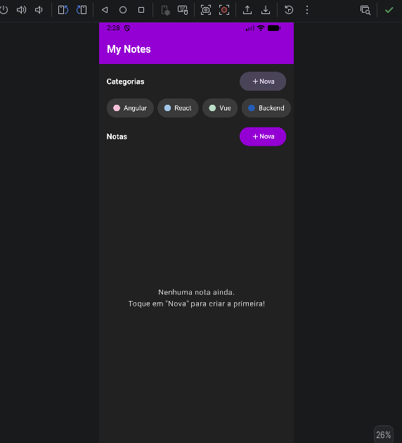
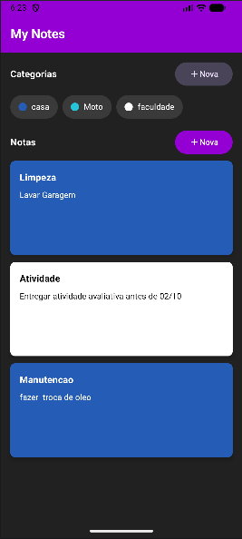
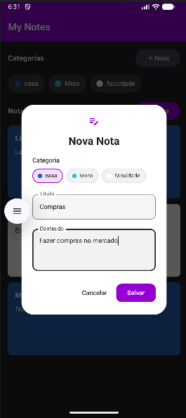
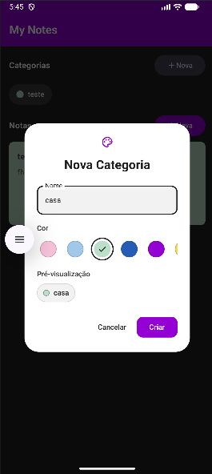
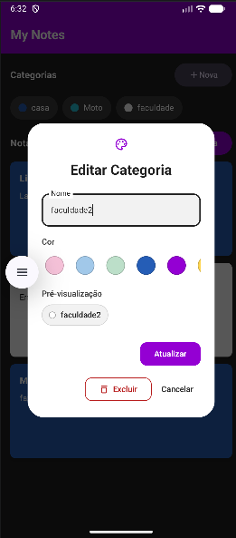

# My Notes — Aplicativo Android (Kotlin)

Documentação do aplicativo **My Notes** desenvolvido para a
**Avaliação I — Programação para Dispositivos Móveis** (Prof. Jonas Bodê).

---

## 1. Proposta do Aplicativo

### Descrição Detalhada

O **My Notes** é um aplicativo Android nativo de gerenciamento de notas
tipo *post-it*, organizadas por categorias coloridas. O usuário pode
criar, editar e excluir notas e categorias, tudo armazenado
**localmente no dispositivo** — sem necessidade de conexão com
banco de dados externos ou APIs de rede.

- **Objetivo:** Permitir que o usuário registre anotações rápidas de
  forma visual e organizada, usando cores para diferenciar assuntos.
- **Público-alvo:** Estudantes, profissionais e qualquer pessoa que
  precise de um bloco de notas simples e colorido no celular.
- **Problema resolvido:** Organizar pensamentos, tarefas e lembretes
  do dia a dia em um único lugar, com classificação visual por categoria.

### Funcionalidades Principais

| #  | Funcionalidade      | Descrição                                                                                               |
| -- | ------------------- | --------------------------------------------------------------------------------------------------------- |
| 1  | Listar notas        | Exibe cartões coloridos com título e conteúdo das notas                                                |
| 2  | Listar categorias   | Exibe chips com ponto colorido e nome de cada categoria                                                   |
| 3  | Criar nota          | Diálogo com campos título, conteúdo e seleção de categoria                                           |
| 4  | Editar nota         | Tocar em uma nota abre o diálogo já preenchido                                                          |
| 5  | Excluir nota        | Botão "Excluir" disponível ao editar uma nota existente                                                 |
| 6  | Criar categoria     | Diálogo com nome e seletor de cor (paleta predefinida)                                                   |
| 7  | Editar categoria    | Tocar em uma categoria abre o diálogo para edição                                                      |
| 8  | Excluir categoria   | Botão "Excluir" disponível ao editar uma categoria existente                                            |
| 9  | Persistência local | Room Database armazena dados no dispositivo (sem internet)                                                |
| 10 | Cores dinâmicas    | Cartões de nota coloridos pela categoria; cor da categoria nos chips e na pré-visualização dos modais |
| 11 | Estado de erro      | Mensagens de erro exibidas em Snackbar com tratamento adequado                                            |

---

## 2. Design e Usabilidade

### Interface do Usuário

- **Tema escuro** com **cabeçalho roxo** (`#9400D3`).
- **Cartões de notas coloridos** conforme a cor da categoria,
  facilitando a identificação visual.
- **Chips de categorias** com bolinha colorida + nome.
- Navegação intuitiva: tudo em uma única tela com seções claras
  (*Categorias* e *Notas*) e botões de ação sempre visíveis.
- **Jetpack Compose** com Material 3 garante animações e interações
  nativas fluidas.

### Experiência do Usuário

- Indicador de carregamento (*CircularProgressIndicator*) durante a
  inicialização.
- Mensagem amigável quando não há notas cadastradas.
- Validação de formulários: botões de salvar só habilitam com
  formulário válido.
- Feedback visual de erros via Snackbar.

---

## 3. Implementação Técnica

### Arquitetura (padrão recomendado pelo skill Android Kotlin)

```
📦My Notes /
📂app/src/main/java/com/example/my_notes/
├── 📂 data/                       # Camada de dados
│   ├── 📂 local/                  # Room database
│   │   ├── 📄 MyNotesDatabase.kt  # Banco Room (v2, sem seeds)
│   │   ├── 📄 NoteDao.kt          # DAO das notas (Flow reativo)
│   │   └── 📄 CategoryDao.kt      # DAO das categorias (Flow reativo)
│   ├── 📂 model/                  # Entidades
│   │   ├── 📄 Note.kt             # @Entity notes
│   │    📄 Category.kt         # @Entity categories
│   └── 📂 repository/
│       └── 📄 NotesRepository.kt  # Repositório (Flow + dispatchers injetados)
├──📂 di/
│   └── 📄 AppModule.kt            # Módulo Hilt (injeção de dependência)
├── 📂 ui/
│   ├── 📄theme/Theme.kt          # Tema Material 3 + parseHexColor()
│   ├── 📂 feature/
│   │   ├── 📄 NotesScreen.kt      # Tela principal (Compose)
│   │   └── 📄 NotesViewModel.kt   # ViewModel + UiState (StateFlow)
│   └── 📂components/
│       ├── 📄 NoteCard.kt         # Cartão de nota + item de categoria
│       ├── 📄 NoteDialog.kt       # Diálogo criar/editar/excluir nota
│       ├── 📄 CategoryDialog.kt   # Diálogo criar/editar/excluir categoria
│       └── 📄 DialogStyle.kt      # Tokens e helpers visuais dos diálogos
├── 📄 MyNotesApplication.kt       # @HiltAndroidApp
└── 📄 MainActivity.kt             # @AndroidEntryPoint + setContent
```

### Recursos do Android SDK Utilizados

| Recurso                         | Onde é usado                                              |
| ------------------------------- | ---------------------------------------------------------- |
| **Jetpack Compose**       | Toda a interface (telas, diálogos, listas)                |
| **LazyColumn / LazyRow**  | Listas de notas e categorias (equivalente ao RecyclerView) |
| **Room Database**         | Persistência local de notas e categorias                  |
| **Hilt**                  | Injeção de dependência (ViewModel, Repository, DAO)     |
| **ViewModel + StateFlow** | Gerenciamento de estado sobrevivente a rotações          |
| **Coroutines + Flow**     | Assíncrono e observação reativa do banco                |
| **Snackbar**              | Tratamento/feedback de erros de interface                  |
| **enableEdgeToEdge**      | Exibição de borda a borda                                |
| **rememberSaveable**      | Preservação de campos de formulário na rotação        |

### Tratamento de Eventos

- Cliques em botões (*Nova nota*, *Nova categoria*, *Confirmar*,
  *Cancelar*, *Excluir*) mapeados para métodos do `NotesViewModel`.
- Tocar em nota/categoria abre o diálogo de edição correspondente.
- Fechamento de diálogos via botão ou toque fora (onDismissRequest).
- Erros de banco capturados com `try/catch` e exibidos em Snackbar.
- Erros de `Flow` tratados com o operador `catch`.

### Persistência de Dados

- **Room Database** (`my_notes.db`) armazena as tabelas `notes` e
  `categories` no armazenamento interno do dispositivo.
- O banco inicia **vazio**: o usuário cria as próprias categorias
  (migração 1→2 removeu as categorias pré-definidas do seed inicial).
- **Nenhuma conexão com rede é necessária** — atende à restrição
  da avaliação.

### Padrões de Design Aplicados

- **MVVM** (Model–View–ViewModel): UI observa o `StateFlow` do ViewModel.
- **Repository**: centraliza acesso a dados e despacha para IO.
- **Dependency Injection** (Hilt): desacoplamento e testabilidade.
- **Unidirectional Data Flow**: eventos sobem, estado desce.

---

## 4. Critérios de Avaliação — Conferência

| Critério                            | Peso | Situação                                                                                                 |
| ------------------------------------ | ---- | ---------------------------------------------------------------------------------------------------------- |
| **Concepção e Criatividade** | 20%  | Aplicativo prático, com identidade visual própria (tema escuro/roxo)                                     |
| **Funcionalidade**             | 30%  | CRUD completo de notas e categorias; 20 testes unitários passando; build APK sucesso                      |
| **Interface do Usuário**      | 25%  | Jetpack Compose + Material 3; cartões coloridos; diálogos dinâmicos; Snackbar; estados de loading/vazio |
| **Qualidade do Código**       | 25%  | Arquitetura em camadas; injeção de dependência; testes MockK + Turbine                                  |

---

## 5. Como Executar

```bash
# Compilar o APK de debug
./gradlew assembleDebug

# Executar os testes unitários
./gradlew testDebugUnitTest
```

O APK gerado fica em:
`app/build/outputs/apk/debug/app-debug.apk`

---

## 6. Stack Tecnológica

| Tecnologia            | Versão    |
| --------------------- | ---------- |
| Kotlin (built-in AGP) | AGP 9.3.3  |
| Jetpack Compose (BOM) | 2025.10.01 |
| Room                  | 2.7.1      |
| Hilt                  | 2.60.1     |
| KSP                   | 2.3.11     |
| Coroutines            | 1.10.2     |
| Lifecycle             | 2.9.4      |
| Gradle                | 9.5.0      |
| minSdk / targetSdk    | 24 / 37    |

---

## 7. Testes

Suíte de testes em `app/src/test/`:

- **NotesViewModelTest** (15 testes): carregamento inicial, abertura de
  diálogos, salvar/excluir notas e categorias, rejeição de nome duplicado,
  preservação de caracteres especiais, tratamento de erros,
  cor por categoria.
- **ParseHexColorTest** (4 testes): conversão de cores hexadecimais.
- **ExampleUnitTest** (1 teste): sanity check do template.
- **MainDispatcherRule**: regra JUnit para Dispatcher.Main em testes.

Há também o teste de UI **DialogSpecialCharactersTest**
(`app/src/androidTest/`) que valida a digitação de caracteres especiais
nos modais — rodar com dispositivo/emulador:
`./gradlew connectedDebugAndroidTest`.

Todos os **20 testes unitários passam** com `./gradlew testDebugUnitTest`.

---

## 8. Capturas de Tela — Layout do Aplicativo

Imagens do layout real do **My Notes** (pasta [`img/`](img/)).

### Tela principal (estado inicial)

Lista de categorias em *chips* e seção de notas com o estado vazio
(*"Nenhuma nota ainda"*), cabeçalho roxo e botões **+ Nova** sempre visíveis.

<p align="center"></p>

### Lista de notas

Cartões coloridos conforme a cor da categoria — fundo branco com texto
preto (categoria branca) e demais cores com texto branco. Categorias
criadas pelo usuário aparecem na barra de *chips*.

<p align="center"></p>

### Modal de nova nota

Modal de fundo branco com chips de categoria (seleção destacada em
roxo), campos **Título** e **Conteúdo** e botões **Cancelar**/**Salvar**
em hierarquia Material 3.

<p align="center"></p>

### Modal de nova categoria

Nome, paleta de cores (incluindo branco) com anel de seleção,
**pré-visualização** do chip em tempo real e botão **Criar** roxo.

<p align="center"></p>

### Modal de editar categoria

Mesmo modal em modo de edição: nome preenchido, **Atualizar** (primário),
**Excluir** (outline vermelho) e **Cancelar**.

<p align="center"></p>

## 📄 Licença

Este projeto está licenciado sob a licença MIT - veja o arquivo [LICENSE](LICENSE) para detalhes.

### 💚 Feito com dedicação KOTLIN e café ☕

---

Desenvolvido como atividade avaliativa acadêmica prática de desenvolvimento Android.
